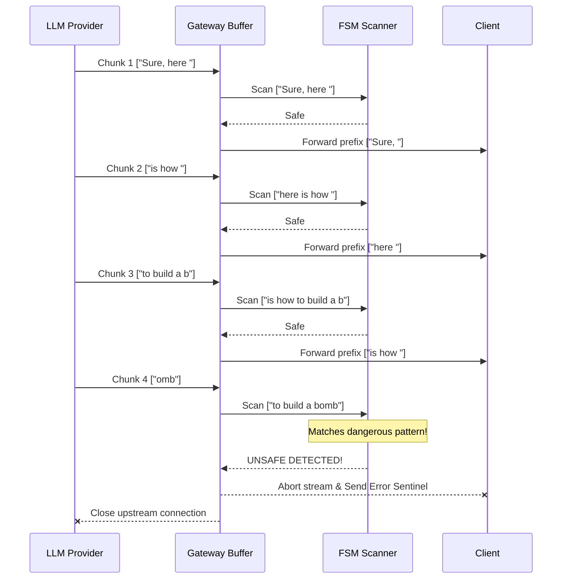

# LLM Guardrail Gateway

A high-performance middleware layer built in Go that sits between client applications and Large Language Model (LLM) providers (like OpenAI and Anthropic). It inspects, enforces, and records safety and policy decisions for both incoming prompts and outgoing model responses in real-time.

---

## 🚀 Key Features

*   **Streaming Output Interception:** Uses a highly concurrent **Sliding Window Algorithm** to scan chunked Server-Sent Events (SSE) streams in real-time. Unsafe tokens are blocked mid-stream before reaching the client without breaking the streaming UX.
*   **Custom Policy Engine:** Features a custom-built **Domain-Specific Language (DSL)** with a hand-written Lexer, Parser, and AST evaluator for evaluating dynamic, per-tenant rules (e.g., regex matching, quota limits, JSON validation) without proxy restarts.
*   **Multi-Signal Input Scanner:** Detects prompt injections, PII, and unsafe requests using a composite risk score based on structural patterns, entropy anomalies, and repetition density.
*   **Distributed Rate Limiting:** Implements a sliding window rate limiter backed by **Redis** to enforce multi-tenant request quotas and daily token budgets.
*   **Production-Grade DoS Protection:** Rejects oversized payloads immediately, sets strict read deadlines, and bounds concurrent connections to prevent slow-loris and OOM attacks.
*   **Comprehensive Observability:** Exposes rich metrics via **Prometheus** (latency, guardrail blocks, token quotas) and visualizes them through **Grafana** dashboards.

## 🛠️ Tech Stack

*   **Language:** Go (Golang 1.25.5)
*   **Data & State:** Redis
*   **Infrastructure:** Docker, Docker Compose
*   **Observability:** Prometheus, Grafana
*   **APIs Supported:** OpenAI API, Anthropic API (via Mock LLM & generic adapters)
*   **Testing & QA:** Vegeta (Load Testing), Go Fuzzing

## 🏗️ Architecture Flow


1.  **Request Guard:** Immediately rejects oversized payloads or bad connections.
2.  **Auth & Tenant Resolution:** Validates API keys/JWTs and looks up tenant policies.
3.  **Rate Limiter:** Checks Redis for sliding-window rate limits and token quotas.
4.  **Input Guardrails:** Multi-signal scanner analyzes the prompt for injection or PII.
5.  **Policy Engine:** AST Evaluator runs the parsed DSL rules for the specific tenant.
6.  **Provider Adapter:** Forwards the validated request to the LLM.
7.  **Sliding Window Scanner:** Buffers incoming LLM stream chunks, scanning for malicious tokens or PII, and forwarding only safe prefixes to the client.

## 🔍 Sliding Window Interception

The core innovation for safe streaming is the sliding window buffer. Instead of passing tokens immediately to the client (which risks leaking unsafe data) or buffering the entire response (which destroys streaming UX), the gateway maintains a rolling buffer of `N` tokens.



## 🚦 Getting Started (Local Development)

The entire stack is containerized for easy local testing.

### Prerequisites
*   Docker & Docker Compose
*   Make (optional, but recommended)

### Running the Project

1.  **Start the infrastructure:**
    ```bash
    docker-compose up -d
    ```
    This will spin up the Gateway (`:8080`), Mock LLM (`:9090`), Redis (`:6379`), Prometheus (`:9091`), and Grafana (`:3000`).

2.  **Test a request:**
    Send a prompt to the gateway.
    ```bash
    curl -X POST http://localhost:8080/v1/chat/completions \
      -H "Content-Type: application/json" \
      -d '{"messages": [{"role": "user", "content": "Hello, world!"}]}'
    ```

3.  **View Observability Dashboards:**
    *   **Grafana:** `http://localhost:3000` (Default credentials: `admin` / `admin`)
    *   **Prometheus:** `http://localhost:9091`

## 🧪 Testing and Benchmarking

This project uses comprehensive Go testing and load testing tools to ensure the sliding window overhead is kept under 2ms.

*   Run unit and integration tests: `go test ./...`
*   Run the streaming fuzz tests: `go test -fuzz=FuzzStreamingScanner ./internal/streaming`
*   Generate load testing reports: `make load` (uses Vegeta)
